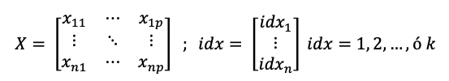

# Documentación Anexa

___

## Algoritmo de agrupamiento K-Medias (K-Means)
### Objetivo:
dividir un conjunto de datos en k grupos de mínima distancia (minimizando las distancias entre elementos dentro de cada grupo).

### Observación:
no está permitido utilizar la función de Matlab *kmeans*, se debe implementar la siguiente función de acuerdo a las siguientes indicaciones.

### Planteamiento del algoritmo:
1. Se eligen k muestras del conjunto de datos para que actúen como semillas. Estas semillas definen las k clases en las que se pretenden agrupar los datos.

_Inicio de inicio del algoritmo: se asume que cada muestra está descrita por dos atributos A1 y A2 (espacio de observaciones bidimensional definido por estos atributos)_

2. Cada muestra del conjunto de datos se añade a la clase más similar (por ejemplo, la muestra se asocia a la clase que se encuentre más cerca en el espacio de observaciones).

3. Se calcula el centroide de cada clase resultante del punto anterior, que pasan a ser las nuevas semillas de las clases.

4. Se repiten los puntos 2 y 3 hasta que se llega a un criterio de convergencia (por ejemplo, dos iteraciones no cambian las clasificaciones de las muestras)

_Ejemplo de primera iteración (pasos 2 y 3): cada muestra se asocia a la semilla que tiene más carca y se calculan los centroides de cada agrupación resultante._

_Ejemplo de segunda iteración_

_Ejemplo de agrupamiento final_

___

# Implementación de Algoritmo de agrupamiento
    [idx, centroides] = funcion_kmeans(X, k)

Sea un conjunto de datos compuesto por n instancias (observaciones, muestras, ejemplos) descritas por un vector de atributos p-dimensional:

## Entradas y salidas:
- *X*: matriz de n filas y p columnas; cada fila almacena los valores de los atributos de una determinada muestra (cada atributo se corresponde con una columna)
- *k*: número de agrupaciones en las que queremos dividir los datos.
- *idx*: vector columna con tantas filas como muestras haya en X (matriz nx1). Cada fila contiene la etiqueta asignada a la clase o agrupación a la que se asocia la muestra de la fila correspondiente de X. Los valores de estas etiquetas para identificar la clase son de 1 a k (números enteros).
- *centroides*: matriz de k filas (número de agrupaciones) y p columnas (número de atributos que describen las muestras). Contiene las coordenadas del centroide (en el espacio de observaciones definido por los atributos) de cada agrupación final que generada por el algoritmo.

## PASOS
(las funciones a las que se hace referencia están definidas a continuación en el apartado funciones auxiliares):

#### 1. Inicialización:
Generar una primera agrupación de los datos, *idx_semilla*, mediante la función *funcion_agrupa_por_desviacion*. Fijarse que el algoritmo no empieza con unos centroides elegidos como semillas, tal como se ha descrito anteriormente en la introducción del algoritmo, sino con una agrupación inicial.

#### 2. Repetir iterativamente:
- 2.1. Calcular la matriz centroides para la idx resultante de la iteración anterior (en la primera iteración, se toma la agrupación idx_semilla). Para ello utiliza la función funcion_calcula_centroides.
- 2.2. Calcula una nueva agrupación a partir de los centroides generados en el paso anterior. Para ello, utiliza la función funcion_calcula_agrupacion.
- 2.3. Compara la agrupación obtenida con la anterior generada. Para ello utiliza la una función funcion_compara_matrices.
- 2.4. Salir si no hay cambios en las agrupaciones.

#### 3. Devolver la última agrupación y centroides obtenidos.

## Funciones auxiliares:
### 1. Función agrupa por el atributo de máxima desviación:
    idx = funcion_agrupa_por_desviacion(X, k)
#### Objetivo y criterio de agrupación de la función:
generar una agrupación inicial de los datos para que la convergencia del algoritmo sea más rápida. Esta agrupación se realiza atendiendo a los valores del atributo que presenta mayor desviación en sus datos (evaluada por la desviación estándar). El rango de valores de variación de este atributo de máxima dispersión, se divide en k intervalos. Las muestras se agrupan atendiendo a su valor del atributo de máxima dispersión: se asigna al intervalo k que contiene el valor.
- 1.1.- Identificar el atributo de máxima dispersión (función std) y almacenar sus valores en una nueva variable.
- 1.2.- Calcular valores representativos de estos valores: valor mínimo y máximo (funciones min , max). Si dividiéramos esos valores en k intervalos iguales, desde el valor mínimo hasta el máximo calculado, calcular la amplitud de ese intervalo.
- 1.3.- Recorrer cada uno de esos k intervalos e ir generando el vector de salida idx: todas las muestras de X que presenten valores del atributo de máxima dispersión dentro de los valores mínimo y máximo del intervalo bajo consideración, se etiquetan en idx con el número de intervalo.

**Observación importante:** se debe garantizar que haya muestras de X en todos los intervalos; en caso de que un intervalo no contenga ninguna muestra de X, ampliar el valor máximo que define ese intervalo para que incluya al menos una muestra de X.

### 2. Función calcula centroides de una determinada agrupación:
    centroides = funcion_calcula_centroides(X, idx)
**Objetivo:** calcular la matriz de centroides (ver definición en la descripción de los parámetros de entrada de la función principal) de los datos X agrupados según *idx*.

### 3. Función calcula centroides de una determinada agrupación:
    idx = funcion_calcula_agrupacion(X, centroides)
**Objetivo:** genera la agrupación de los datos X de acuerdo a centroides. Para ello,
se debe asignar cada muestra de X al centroide más próximo según distancia Euclidea.

### 4. Función compara matrices:
    varLogica = funcion_compara_matrices(matriz1, matriz2)
donde *varLogica* toma el valor *True* si las matrices con iguales y *False* en caso contrario.