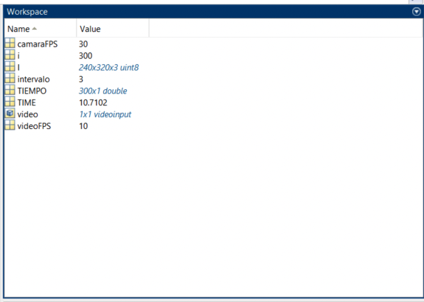

# IMPLEMENTACIÓN DE ALGORITMO BÁSICO DE SEGUIMIENTO DE OBJETOS POR COLOR
:computer: Proyecto práctico para la asignatura Sistemas de Percepción   
:school: Universidad de Huelva  
:books: Curso 2019-2020

___

# Objetivo del trabajo
Generar una secuencia de video que muestre el seguimiento de un objeto de una escena captada por una WebCam. El seguimiento se basará en el color del objeto y se visualizará a través de una marca en el centroide de cada agrupación conexa de píxeles detectada.

___

# 1. Generación de material
El código se encuentra en el script de la carpeta [01_GeneracionMaterial](https://github.com/byLiTTo/SP-SeguimientoColor/blob/main/01_GeneracionMaterial/GeneracionMaterial.m).
## 1.1. Secuencia de video para evaluar el funcionamiento del algoritmo de seguimiento:
Generar un archivo de video con el objeto de estudio moviéndose por una determinada región del espacio.

##### Obtención de FPS de la cámara
```
video = videoinput('winvideo',1,'YUY2_320x240');
video.TriggerRepeat = inf;
video.FrameGrabInterval = 1;

TIEMPO = [];

disp('ACTIVANDO cámara para cálculo de FPS');
start(video)
while video.FramesAcquired < 300
    [I TIME] = getdata(video,1);
    TIEMPO = [TIEMPO; TIME];
end
stop(video)
flushdata(video);
disp('APAGANDO cámara');

% Contador donde obtendremos los FPS a los que trabaja nuestra cámara
camaraFPS = 0;
for i=1:length(TIEMPO)
    if floor(TIEMPO(i)) == 1
        camaraFPS = camaraFPS+1;
    end
end

% Número de FPS a los que queremos que se grabe el vídeo
videoFPS = 10;

% Intervalo de captura de cada frame al que debe trabajar el vídeo,
% para que se grabe a la cantidad de FPS deseada
intervalo = camaraFPS/videoFPS;
```


## 1.2. Imágenes de calibración:
Capturar varias imágenes con el objeto situado en distintas posiciones representativas de la región del espacio que queramos monitorizar, así como una imagen representativa del fondo de la escena (sin el objeto, en la situación más parecida a las imágenes que se hicieron con el objeto).

___

# 2. Generación de conjunto de datos
## 2.1. Extracción de datos del color objeto de seguimiento y otros colores del fondo de la escena
### 2.1.1. Para cada imagen de calibración que contiene el objeto:
Seleccionar una región de píxeles con el color de seguimiento. Almacenar los valores R, G y B de todos los píxeles seleccionados. Para ello, utilizar una matriz Matlab DatosColor, con 4 campos: identificador de la imagen, valores R, G y B.
### 2.1.2. Para la imagen de fondo:
Seleccionar varias regiones de píxeles que no sean del color de seguimiento (también se pueden utilizar las imágenes que tienen el objeto, siempre que se seleccionen regiones donde no esté el objeto). Almacenar los valores R, G y B de todos los píxeles seleccionados. Para ello, utilizar una matriz Matlab DatosFondo, con 4 campos: identificador de la region, valores R, G y B.

AyudaMatlab:instrucción roipoly

### 2.1.3. Generación de un primer conjunto de datos X e Y:
- X: matriz de tantas filas como muestras de píxeles haya en DatosColor y DatosFondo
y tres columnas (valores de R, G y B). Es decir, se genera concatenando verticalmente la información RGB de DatosColor y DatosFondo.

- Y: vector columna con dos posibles valores: 0 y 1. El valor 0 se asignará a aquellas filas de X que se correspondan con muestras del fondo; el 1 es el valor de codificación que se utilizará para indicar que la fila de datos de X pertenece a la clase de píxeles del color de seguimiento.

## 2.2. Representación de los datos del color objeto de seguimiento y otros del fondo de la escena
### 2.2.1. Representar en el espacio RGB:
Con un rango de variación 0-255 en los tres ejes, todos los valores RGB de los píxeles del color de seguimiento y del fondo de la escena. En la representación, utilizar distintos colores para distinguir las dos clases consideradas: color de seguimiento, color/es de fondo.

## 2.3. Eliminación de valores atípicos en los datos del color de seguimiento
### 2.3.1. Eliminar valores atípicos o outliers en las muestras de X correspondientes a los píxeles del color de seguimiento.
Para ello, se eliminará una instancia completa de esta clase de salida (color de seguimiento) si el valor de cualquiera de sus atributos está fuera de su rango “normal” de variación. Este rango se define para cada atributo como la media más menos tres veces la desviación estándar de sus valores.
### 2.3.2. Generar el conjunto de datos final X e Y:
Sin outliers en la clase del color de seguimiento (las instancias anómalas eliminadas de X también han de eliminarse en Y).
### 2.3.3. Representar en el espacio RGB todos los valores RGB
De los píxeles del color de seguimiento y del fondo de la escena del conjunto de datos final, distinguiendo las muestras del color de seguimiento y las del fondo de la escena.

___

# 3. Diseño y entrenamiento del clasificador
## 3.1. Elección de estrategia de clasificación

**Objetivos al realizar el seguimiento del objeto. Diferentes posibilidades:**
1. No perder el objeto de seguimiento en sus diferentes posiciones, aunque esto suponga detectar fondo de la escena no deseado (ruido).
2. No detectar nada de ruido de fondo, aunque esto suponga dejar de detectar algunos píxeles del color objeto de seguimiento.
3. Compromiso en la detección de píxeles del objeto y el ruido de fondo: se debe intentar detectar el mayor número de píxeles del objeto, minimizando la cantidad de ruido.

**Planteamiento:**
Considerar que el color de seguimiento está compuesto por todos los puntos de una determinada región del espacio RGB. Para determinar esta región pueden utilizarse diferentes estrategias. Vamos a considerar que esta región estará delimitada por superficies esféricas, cuyos centros y radios habrá que determinar para que se ajusten y contengan a todas las muestras disponibles del color de seguimiento.

Para ello, como paso previo, se debe aplicar el algoritmo de agrupamiento de datos que se facilita como documentación anexa. Este algoritmo permite dividir las muestras del color de seguimiento en un número de agrupaciones igual al número de esferas que se deseen emplear.

Este planteamiento considera que un pixel cuya componente de color RGB se encuentre contenido en una de las esferas anteriores, dada por un centro y un radio, es un píxel del color de seguimiento. Esto se puede evaluar verificando que la distancia Euclidea entre los valores RGB del píxel en cuestión y el centro de cualquier esfera sea menor que el radio de ésta.

### 3.1.1. Añadir a la representación del apartado 2.2.1 las superficies esféricas a las que hace referencia el planteamiento anterior.
Para ello, se deben agrupar los datos disponibles para el color de seguimiento y, para cada agrupación de datos obtenida, se determinará el centro y radios posibles de las esferas asociadas a cada agrupación. Según el objetivo perseguido, los valores de radio de las esferas que pueden ser de interés pueden calcularse de la siguiente forma:
- Valores de radio para detectar el mayor número posible de píxeles del color objeto de seguimiento (objetivo número 1): para cada esfera, calcular todos los valores de distancia entre los valores (R, G, B) de los píxeles del color de la agrupación y el color medio (Rc, Gc, Bc). El valor de distancia máxima es el valor de radio de la esfera que contiene a todos los píxeles de la agrupación.
- Valores de radio para no detectar ruido de fondo (objetivo número 2): se debe seleccionar un valor de radio de las esferas que no contengan ruido de fondo, para lo cual habrá que medir la distancia de todos los puntos de fondo al centro de la esfera y comprobar que se sitúan fuera de la esfera.
- Valores de radio de compromiso en la detección de píxeles del objeto y ruido: pueden considerarse los valores de radio promedio de los valores obtenidos en los puntos anteriores.

## 3.2. Entrenamiento del clasificador: Calibración y ajuste de parámetros.
**Parámetros de calibración:**
**Umbrales de distancia Euclidea (radios de las superficies esféricas):** el algoritmo de seguimiento calculará la distancia Euclidea de todos los píxeles de la imagen respecto a los centros de las superficies esféricas consideradas; considerará que los píxeles cuyas componentes de color se desvíen menos de una distancia umbral respecto al centro de cualquier esfera considerada, son de ese color. Hay que encontrar valores apropiados para estos umbrales de distancia.⁄

**Umbral de conectividad:** el paso anterior decide valores adecuados de umbral de distancia y da lugar a una imagen binaria resultado de umbralizar medidas de distancia. A continuación, el algoritmo descartará aquellas componentes conexas cuyo número de píxeles sea inferior a uno dado. Hay que ajustar este parámetro.

### 3.2.1. Procedimiento de ajuste umbral de distancia:
para cada una de las imágenes de calibración y varios valores posibles de umbral de distancia (en el apartado 3.1.1 se han calculado 3 posibles valores con distintos criterios):
- Calcular matrices de distancias.
- Detectar aquellos píxeles cuyo color “se parezca” al color del seguimiento
(binarizar la matriz distancia los umbrales de distancia).
- Visualizar, sobre la imagen original, el resultado de la detección.
- Analizar las gráficas, crear nuevas con otros valores de umbrales si fuese necesario y decidir un valor de umbral apropiado.

### 3.2.2. Procedimiento de ajuste de umbral de conectividad:
para cada una de las imágenes de calibración y varios valores posibles de umbral de conectividad (en este caso es una referencia útil saber el número de píxeles que tiene el objeto de seguimiento en su posición más alejada, que es cuando tiene menor tamaño):
- Calcular las matrices de distancias y binarizarlas con los umbrales seleccionados.
- Eliminar las componentes conexas más pequeñas de acuerdo al umbral de
conectividad.
- Visualizar sobre la imagen original el resultado de este proceso de filtrado.
- Analizar las gráficas, crear nuevas con otros valores de conectividad si fuese necesario y decidir un valor de umbral apropiado.

### 3.2.3. Guardar en una variable matlab los parámetros de calibración:
color medio de seguimiento, valores elegidos de umbral de distancia y conectividad.

___

# 4. Implementación y visualización de algoritmo de seguimiento
Para comprobar cómo se comporta el algoritmo de seguimiento, este se aplicará sobre el archivo de video generado. Atendiendo a la estrategia de funcionamiento elegida, el algoritmo debe:
- Cargar los parámetros de calibración.
- Leer la secuencia de video. Para cada frame de la misma:
    - Calcular matrices de distancias.
    - Detectar aquellos píxeles cuyo color se considere que sea del color del seguimiento
    - Eliminar las componentes conexas más pequeñas.
    - Marcar el centroide de los objetos presentes.
- Generar la secuencia de video que muestre el seguimiento del objeto.

___